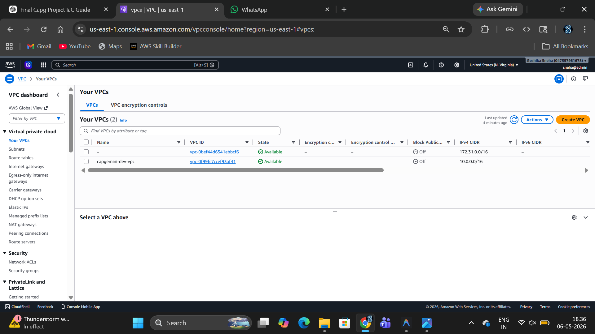

# 🏗️ Capgemini IaC Project — AWS Infrastructure with Terraform

<div align="center">


**A modular, policy-governed, cost-optimised AWS infrastructure built with Terraform.**  
Designed for real-world DevOps workflows — from remote state to OPA policy validation.

</div>

---

## 📑 Table of Contents

1. [Project Overview](#-project-overview)
2. [Architecture](#-architecture)
3. [AWS Services Used](#-aws-services-used)
4. [Folder Structure](#-folder-structure)
5. [Terraform Modules](#-terraform-modules)
6. [OPA Policy Validation](#-opa-policy-validation)
7. [Deployment Steps](#-deployment-steps)
8. [Terraform Commands](#-terraform-commands)
9. [Screenshots](#-screenshots)
10. [Outputs](#-outputs)
11. [Security Features](#-security-features)
12. [Cost Optimisation](#-cost-optimisation)
13. [Future Improvements](#-future-improvements)
14. [Author](#-author)

---

## 📌 Project Overview

The **Capgemini IaC Project** is a production-grade, modular AWS infrastructure defined entirely as code using **Terraform**. It follows Infrastructure-as-Code (IaC) best practices and integrates **Policy-as-Code (PaC)** using **OPA (Open Policy Agent)** and **Conftest** to enforce security and compliance *before* any resource is deployed.

### ✅ Key Highlights

| Feature | Details |
|---|---|
| **Cloud Provider** | Amazon Web Services (AWS) |
| **IaC Tool** | Terraform (HashiCorp) |
| **Policy-as-Code** | OPA + Conftest |
| **Environment** | `dev` (free-tier compatible) |
| **Region** | `us-east-1` (N. Virginia) |
| **State Backend** | Remote — S3 + DynamoDB locking |
| **Architecture** | Modular Terraform (4 reusable modules) |
| **NAT Gateway** | Disabled (cost-optimised for dev) |
| **Free-Tier Compatible** | ✅ Yes (`t3.micro`, `db.t3.micro`, 20 GiB storage) |

---

## 🏛️ Architecture

The infrastructure follows a classic **three-tier VPC architecture** split across two Availability Zones:

```
┌────────────────────────────────────────────────────────────┐
│                    AWS Region: us-east-1                   │
│                                                            │
│  ┌──────────────────────────────────────────────────────┐  │
│  │              VPC  (10.0.0.0/16)                      │  │
│  │                                                      │  │
│  │  ┌───────────────────┐  ┌───────────────────────┐   │  │
│  │  │  Public Subnet    │  │   Public Subnet        │   │  │
│  │  │  10.0.1.0/24      │  │   10.0.2.0/24          │   │  │
│  │  │  (us-east-1a)     │  │   (us-east-1b)         │   │  │
│  │  │  ┌─────────────┐  │  │                        │   │  │
│  │  │  │ EC2 Instance│  │  │                        │   │  │
│  │  │  │  t3.micro   │  │  │                        │   │  │
│  │  │  └─────────────┘  │  │                        │   │  │
│  │  └────────┬──────────┘  └────────────────────────┘   │  │
│  │           │  Internet Gateway                         │  │
│  │  ┌────────┴──────────┐  ┌───────────────────────┐   │  │
│  │  │  Private Subnet   │  │   Private Subnet       │   │  │
│  │  │  10.0.10.0/24     │  │   10.0.20.0/24         │   │  │
│  │  │  (us-east-1a)     │  │   (us-east-1b)         │   │  │
│  │  │  ┌─────────────┐  │  │                        │   │  │
│  │  │  │  RDS MySQL  │  │  │                        │   │  │
│  │  │  │ db.t3.micro │  │  │                        │   │  │
│  │  │  └─────────────┘  │  │                        │   │  │
│  │  └───────────────────┘  └───────────────────────┘   │  │
│  └──────────────────────────────────────────────────────┘  │
│                                                            │
│  S3 Bucket (Private)    S3 Bucket (Terraform State)        │
│  DynamoDB Table (State Locking)                            │
└────────────────────────────────────────────────────────────┘
```

### Network Layout

| Subnet | CIDR | Availability Zone | Purpose |
|---|---|---|---|
| Public Subnet A | `10.0.1.0/24` | `us-east-1a` | EC2, Internet-facing workloads |
| Public Subnet B | `10.0.2.0/24` | `us-east-1b` | Spare / ALB (future) |
| Private Subnet A | `10.0.10.0/24` | `us-east-1a` | RDS, app servers |
| Private Subnet B | `10.0.20.0/24` | `us-east-1b` | RDS Multi-AZ standby |

---

## ☁️ AWS Services Used

| Service | Resource | Description |
|---|---|---|
| **VPC** | `aws_vpc` | Isolated virtual network (10.0.0.0/16) |
| **Subnets** | `aws_subnet` | 2 public + 2 private across 2 AZs |
| **Internet Gateway** | `aws_internet_gateway` | Enables public subnet internet access |
| **Route Tables** | `aws_route_table` | Controls traffic routing per subnet |
| **Security Groups** | `aws_security_group` | Stateful firewall rules for EC2 & RDS |
| **EC2** | `aws_instance` | `t3.micro` — free-tier compute |
| **EBS Volume** | `aws_ebs_volume` | 20 GiB gp3, encrypted at rest |
| **RDS MySQL** | `aws_db_instance` | `db.t3.micro` — private database |
| **S3** | `aws_s3_bucket` | Private object storage, versioned |
| **S3 Backend** | `aws_s3_bucket` | Remote Terraform state storage |
| **DynamoDB** | `aws_dynamodb_table` | State locking to prevent concurrent applies |

---

## 📁 Folder Structure

```
capgemini-iac-project/
│
├── 📄 main.tf                   # Root module — wires all modules together
├── 📄 variables.tf              # Top-level input variable declarations
├── 📄 outputs.tf                # Root-level outputs from all modules
├── 📄 providers.tf              # AWS provider + default tags configuration
├── 📄 backend.tf                # Remote state: S3 + DynamoDB locking
├── 📄 versions.tf               # Terraform & provider version constraints
├── 📄 terraform.tfvars          # Dev environment variable values
│
├── 📁 modules/
│   ├── 📁 networking/           # VPC, subnets, IGW, route tables
│   │   ├── main.tf
│   │   ├── variables.tf
│   │   ├── outputs.tf
│   │   ├── locals.tf
│   │   └── README.md
│   │
│   ├── 📁 compute/              # EC2 instance, security group, key pair
│   │   ├── main.tf
│   │   ├── variables.tf
│   │   ├── outputs.tf
│   │   ├── locals.tf
│   │   └── README.md
│   │
│   ├── 📁 database/             # RDS MySQL, subnet group, parameter group
│   │   ├── main.tf
│   │   ├── variables.tf
│   │   ├── outputs.tf
│   │   ├── locals.tf
│   │   └── README.md
│   │
│   └── 📁 storage/              # S3 bucket, versioning, encryption, ACLs
│       ├── main.tf
│       ├── variables.tf
│       ├── outputs.tf
│       ├── locals.tf
│       └── README.md
│
├── 📁 policies/                 # OPA (Rego) policy files for Conftest
│   ├── deny_public.rego         # Blocks public S3 bucket configurations
│   ├── enforce_tags.rego        # Mandates Project, Environment, ManagedBy tags
│   └── restrict_vm.rego         # Restricts EC2/RDS to approved instance sizes
│
├── 📁 environments/             # Per-environment tfvars (staging, prod)
├── 📁 Screenshots/              # AWS Console proof-of-deployment screenshots
├── 📁 docs/                     # Additional documentation
│
├── 📄 .gitignore                # Excludes secrets, .terraform/, state files
└── 📄 .terraform.lock.hcl       # Provider version lock file
```

---

## 🧩 Terraform Modules

The project is broken into **four independent, reusable modules** following the separation-of-concerns principle.

### 🌐 `modules/networking`

Provisions the entire network foundation for the project.

| Resource | Count | Details |
|---|---|---|
| VPC | 1 | `10.0.0.0/16`, DNS hostnames enabled |
| Public Subnets | 2 | One per AZ, `map_public_ip_on_launch = true` |
| Private Subnets | 2 | One per AZ, no public IP assignment |
| Internet Gateway | 1 | Attached to VPC for public traffic |
| Route Table (Public) | 1 | `0.0.0.0/0 → IGW` |
| Route Table (Private) | 2 | Local routing only (NAT disabled in dev) |

### 💻 `modules/compute`

Provisions the EC2 instance and its security group.

| Resource | Details |
|---|---|
| EC2 Instance | `t3.micro`, Amazon Linux 2 AMI (latest) |
| Root Volume | 20 GiB, gp3, encrypted at rest |
| Security Group | SSH (22), HTTP (80), HTTPS (443) |
| Key Pair | `capgemini-dev-keypair` |

### 🗄️ `modules/database`

Provisions a private RDS MySQL instance with hardened settings.

| Resource | Details |
|---|---|
| RDS Instance | `db.t3.micro`, MySQL 8.0 |
| Storage | 20 GiB gp3, auto-scaling enabled |
| Subnet Group | Spans both private subnets (Multi-AZ ready) |
| Security Group | Port 3306, EC2 SG as source only |
| Deletion Protection | Disabled in dev, enable in prod |

### 📦 `modules/storage`

Provisions a private, versioned, encrypted S3 bucket.

| Resource | Details |
|---|---|
| S3 Bucket | Private, versioning enabled |
| Encryption | SSE-S3 (AES-256) server-side encryption |
| Public Access Block | All four block settings set to `true` |
| Bucket Policy | Denies any `s3:GetObject` without encryption |

---

## 🛡️ OPA Policy Validation

This project uses **[OPA (Open Policy Agent)](https://www.openpolicyagent.org/)** via **[Conftest](https://www.conftest.dev/)** to validate the Terraform plan *before* any infrastructure is created. This enforces security and cost guardrails at the **plan stage**, not after deployment.

### Policies

| Policy File | What It Enforces |
|---|---|
| `deny_public.rego` | Blocks S3 buckets without all four public-access-block settings enabled |
| `enforce_tags.rego` | Requires `Project`, `Environment`, and `ManagedBy` tags on all taggable resources |
| `restrict_vm.rego` | Restricts EC2 to `{t2.micro, t2.small, t3.micro, t3.small}` and RDS to approved classes |

### Policy Details

<details>
<summary><strong>deny_public.rego</strong> — Prevent Public S3 Buckets</summary>

Inspects `aws_s3_bucket_public_access_block` resources in the Terraform plan and denies deployment if any of the four settings (`block_public_acls`, `block_public_policy`, `ignore_public_acls`, `restrict_public_buckets`) are `false` or missing.

```rego
deny[msg] {
    resource := s3_public_access_blocks[_]
    not resource.change.after.block_public_acls
    msg := sprintf("DENY: S3 public access block '%s' must have block_public_acls = true.", [resource.address])
}
```

</details>

<details>
<summary><strong>enforce_tags.rego</strong> — Mandatory Resource Tagging</summary>

Enforces that every taggable AWS resource (`aws_vpc`, `aws_subnet`, `aws_instance`, `aws_s3_bucket`, `aws_db_instance`, etc.) includes the three required tags:

```rego
required_tags := ["Project", "Environment", "ManagedBy"]
```

</details>

<details>
<summary><strong>restrict_vm.rego</strong> — EC2 & RDS Size Guardrails</summary>

Prevents costly instance types from being deployed accidentally. Allowed types:

```rego
allowed_instance_types    := { "t2.micro", "t2.small", "t3.micro", "t3.small" }
allowed_db_instance_classes := { "db.t2.micro", "db.t3.micro", "db.t3.small", "db.t3.medium" }
```

</details>

### Running Policy Validation

```bash
# Step 1: Generate the Terraform plan binary
terraform plan -out=tfplan.binary

# Step 2: Convert the plan to JSON (readable by Conftest/OPA)
terraform show -json tfplan.binary > tfplan.json

# Step 3: Run all OPA policies against the plan
conftest test tfplan.json --policy policies/
```

**Example output (all policies pass):**
```
10 tests, 10 passed, 0 warnings, 0 failures
```

**Example output (policy violation):**
```
FAIL - tfplan.json - main - DENY: EC2 instance 'module.compute.aws_instance.this'
  uses instance type 'm5.large' which is not allowed.
  Permitted types: {"t2.micro", "t2.small", "t3.micro", "t3.small"}
```

---

## 🚀 Deployment Steps

Follow these steps in order to deploy the infrastructure from scratch.

### Prerequisites

Ensure the following tools are installed and configured:

| Tool | Version | Install |
|---|---|---|
| [Terraform](https://developer.hashicorp.com/terraform/install) | `>= 1.3` | `choco install terraform` |
| [AWS CLI](https://aws.amazon.com/cli/) | `>= 2.x` | `choco install awscli` |
| [OPA](https://www.openpolicyagent.org/docs/latest/#running-opa) | `>= 0.60` | `choco install opa` |
| [Conftest](https://www.conftest.dev/install/) | `>= 0.45` | `choco install conftest` |

### Step 1 — Configure AWS Credentials

```bash
aws configure
# Enter: AWS Access Key ID, Secret Access Key, Region (us-east-1), Output format (json)
```

### Step 2 — Create Remote State Infrastructure

> ⚠️ **Run these AWS CLI commands once before `terraform init`.** Terraform cannot create its own backend.

```bash
# Create the S3 bucket for state storage
aws s3api create-bucket \
  --bucket capgemini-terraform-state-sneha \
  --region ap-south-1 \
  --create-bucket-configuration LocationConstraint=ap-south-1

# Enable versioning (allows state file rollback)
aws s3api put-bucket-versioning \
  --bucket capgemini-terraform-state-sneha \
  --versioning-configuration Status=Enabled

# Enable server-side encryption (AES-256)
aws s3api put-bucket-encryption \
  --bucket capgemini-terraform-state-sneha \
  --server-side-encryption-configuration \
    '{"Rules":[{"ApplyServerSideEncryptionByDefault":{"SSEAlgorithm":"aws:kms"}}]}'

# Block all public access to the state bucket
aws s3api put-public-access-block \
  --bucket capgemini-terraform-state-sneha \
  --public-access-block-configuration \
    BlockPublicAcls=true,IgnorePublicAcls=true,BlockPublicPolicy=true,RestrictPublicBuckets=true

# Create DynamoDB table for state locking
aws dynamodb create-table \
  --table-name terraform-locks \
  --attribute-definitions AttributeName=LockID,AttributeType=S \
  --key-schema AttributeName=LockID,KeyType=HASH \
  --billing-mode PAY_PER_REQUEST \
  --region ap-south-1
```

### Step 3 — Initialise Terraform

```bash
terraform init
```

### Step 4 — Validate OPA Policies

```bash
terraform plan -out=tfplan.binary
terraform show -json tfplan.binary > tfplan.json
conftest test tfplan.json --policy policies/
```

### Step 5 — Review the Plan

```bash
terraform plan -var="db_password=YourSecureP@ss123!"
```

### Step 6 — Apply the Infrastructure

```bash
terraform apply -var="db_password=YourSecureP@ss123!"
# Type 'yes' when prompted
```

### Step 7 — View Outputs

```bash
terraform output
```

### Step 8 — Destroy (when done)

```bash
terraform destroy -var="db_password=YourSecureP@ss123!"
```

---

## ⌨️ Terraform Commands

Quick reference for all Terraform commands used in this project:

```bash
# Initialise the project and download providers
terraform init

# Validate the configuration syntax
terraform validate

# Format all .tf files consistently
terraform fmt -recursive

# Preview changes (no DB password stored in plan)
terraform plan -var="db_password=YOUR_PASSWORD"

# Preview and save plan to file
terraform plan -var="db_password=YOUR_PASSWORD" -out=tfplan.binary

# Convert plan to JSON for OPA/Conftest
terraform show -json tfplan.binary > tfplan.json

# Run OPA policies against the plan
conftest test tfplan.json --policy policies/

# Apply changes interactively
terraform apply -var="db_password=YOUR_PASSWORD"

# Apply saved plan (no confirmation prompt)
terraform apply tfplan.binary

# View current state outputs
terraform output

# Show full state in JSON
terraform show -json

# List all resources in state
terraform state list

# Destroy all resources
terraform destroy -var="db_password=YOUR_PASSWORD"

# Use environment-specific tfvars
terraform plan -var-file="environments/staging.tfvars" -var="db_password=YOUR_PASSWORD"
```

> 💡 **Tip:** Set `TF_VAR_db_password` as an environment variable to avoid typing the password every time:
> ```bash
> # Windows PowerShell
> $env:TF_VAR_db_password = "YourSecureP@ss123!"
> terraform apply
> ```

---

## 📸 Screenshots

Real deployment screenshots from the AWS Management Console:

### VPC


### Public & Private Subnets


### Internet Gateway


### Route Tables


### Security Groups


### EC2 Instance


### RDS Database


### S3 Bucket


### Terraform Apply Output


---

## 📤 Outputs

After a successful `terraform apply`, the following values are printed:

### Networking

| Output | Description |
|---|---|
| `vpc_id` | ID of the created VPC |
| `vpc_cidr_block` | CIDR block of the VPC |
| `public_subnet_ids` | List of public subnet IDs |
| `private_subnet_ids` | List of private subnet IDs |
| `internet_gateway_id` | ID of the Internet Gateway |
| `nat_gateway_ids` | List of NAT Gateway IDs (empty if disabled) |

### Compute

| Output | Description |
|---|---|
| `instance_id` | EC2 instance ID |
| `instance_public_ip` | Public IP address of the EC2 instance |
| `instance_private_ip` | Private IP address of the EC2 instance |
| `security_group_id` | ID of the EC2 security group |

### Database

| Output | Description |
|---|---|
| `db_endpoint` | RDS connection endpoint (`host:port`) |
| `db_address` | RDS hostname |
| `db_port` | Database port (3306 for MySQL) |
| `db_security_group_id` | ID of the RDS security group |

### Storage

| Output | Description |
|---|---|
| `s3_bucket_id` | Name of the S3 bucket |
| `s3_bucket_arn` | ARN of the S3 bucket |
| `s3_versioning_status` | Versioning status (`Enabled` / `Suspended`) |

---

## 🔒 Security Features

This project implements multiple layers of security:

| Security Control | Implementation |
|---|---|
| **Encrypted State File** | S3 backend with `encrypt = true` (SSE-KMS) |
| **State Locking** | DynamoDB prevents concurrent `terraform apply` |
| **Encrypted EBS Volume** | EC2 root volume encrypted at rest (gp3) |
| **Encrypted RDS Storage** | RDS storage encrypted at rest |
| **Private RDS** | Database lives in private subnets only |
| **Restricted DB Access** | RDS security group only allows EC2 SG as source |
| **S3 Public Access Blocked** | All four public-access-block settings enabled |
| **S3 Versioning** | Enables recovery from accidental deletion |
| **Provider Default Tags** | All resources auto-tagged with `Project` and `ManagedBy` |
| **Policy-as-Code** | OPA/Conftest validates plan before `apply` |
| **No Secrets in Code** | `db_password` marked `sensitive = true`, never in `.tfvars` |
| **Variable Validation** | `environment` restricted to `dev`, `staging`, `prod` |

> ⚠️ **Production Hardening Checklist:**
> - Restrict `ssh_allowed_cidrs` to your specific IP instead of `0.0.0.0/0`
> - Enable `deletion_protection = true` on the RDS instance
> - Enable `enable_nat_gateway = true` for private subnet egress
> - Use AWS Secrets Manager for the database password
> - Enable VPC Flow Logs for network monitoring
> - Enable CloudTrail for API audit logging

---

## 💰 Cost Optimisation

This project is designed to be **free-tier compatible** and cost-conscious:

| Optimisation | Saving | Detail |
|---|---|---|
| **NAT Gateway Disabled** | ~$32/month | `enable_nat_gateway = false` in dev |
| **t3.micro EC2** | Free-tier eligible | 750 hrs/month free for 12 months |
| **db.t3.micro RDS** | Free-tier eligible | 750 hrs/month free for 12 months |
| **20 GiB Storage** | Free-tier eligible | 20 GiB free for RDS + EC2 |
| **PAY_PER_REQUEST DynamoDB** | ~$0.00/month | Only charged per lock operation |
| **Single NAT Gateway** | Saves ~$32/month vs per-AZ | When NAT is enabled, `single_nat_gateway = true` |
| **gp3 EBS Volumes** | ~20% cheaper than gp2 | Same performance, lower cost |

### Estimated Monthly Cost (Dev Environment)

| Resource | Estimated Cost |
|---|---|
| EC2 `t3.micro` | $0.00 (free tier) |
| RDS `db.t3.micro` | $0.00 (free tier) |
| S3 Bucket (minimal data) | ~$0.01 |
| DynamoDB (state lock) | ~$0.00 |
| Data Transfer | ~$0.00 |
| **Total** | **~$0.01/month** |

---

## 🔮 Future Improvements

Planned enhancements for staging and production environments:

- [ ] **Multi-environment support** — Add `environments/staging.tfvars` and `environments/prod.tfvars`
- [ ] **NAT Gateway** — Enable for private subnet egress in staging/prod (`enable_nat_gateway = true`)
- [ ] **Application Load Balancer** — Add ALB module in front of EC2 for high availability
- [ ] **Auto Scaling Group** — Replace single EC2 with ASG for elasticity and HA
- [ ] **RDS Multi-AZ** — Enable `multi_az = true` in production for failover support
- [ ] **AWS Secrets Manager** — Replace `TF_VAR_db_password` with Secrets Manager integration
- [ ] **VPC Flow Logs** — Enable for network traffic visibility and security auditing
- [ ] **AWS WAF** — Add Web Application Firewall in front of the ALB
- [ ] **CloudWatch Alarms** — Add CPU, memory, and disk alarms for EC2 and RDS
- [ ] **GitHub Actions CI/CD** — Automate `terraform plan` + OPA validation on every pull request
- [ ] **Terratest** — Add automated infrastructure tests using Go
- [ ] **Cost Budget Alerts** — Set up AWS Budgets to alert on unexpected spend

---

## 👩‍💻 Author

<div align="center">

**Sneha Goshika**  
*Cloud & DevOps Engineer*

[](https://github.com/GOSHIKASNEHA)
[](https://linkedin.com/in/goshikasneha)

</div>

---

<div align="center">

*Built with ❤️ using Terraform, AWS, and OPA*  
*Capgemini IaC Project — 2026*

</div>
